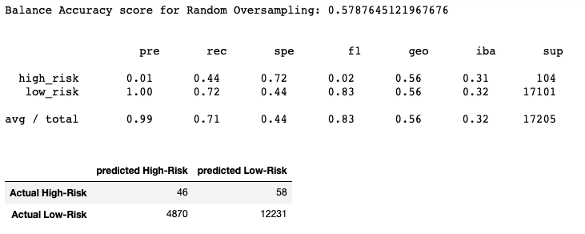
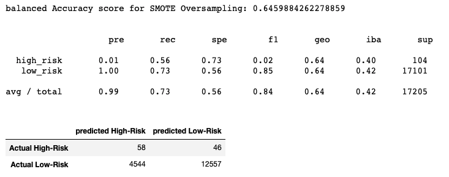
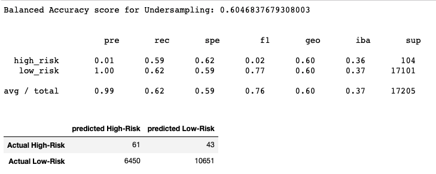
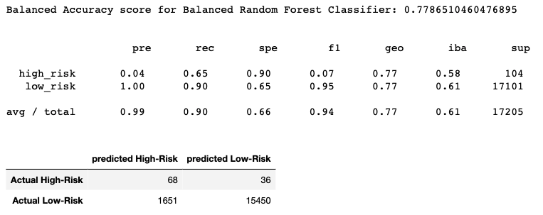
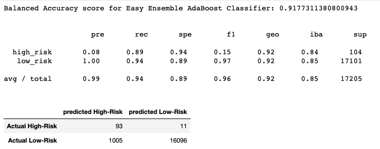
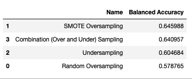
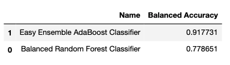

# Credit_Risk_Analysis

## Overview
Credit risk is an inherently unbalanced classification problem, as good loans easily outnumber risky loans. In this project, we use the credit card credit dataset from LendingClub, a peer-to-peer lending services company, we employ different techniques to train and evaluate models with unbalanced classes. We use imbalanced-learn and scikit-learn libraries to build and evaluate models using resampling.

First, we oversample the data using the RandomOverSampler and SMOTE algorithms, and undersample the data using the ClusterCentroids algorithm. Next, we use a combinatorial approach of over and undersampling using the SMOTEENN algorithm. Then, we compare two new machine learning models that reduce bias, BalancedRandomForestClassifier and EasyEnsembleClassifier, to predict credit risk. Finally, we evaluate the performance of these models and make a written recommendation on whether they should be used to predict credit risk.

## Results
<h3>Naive Random Oversampling</h3>

 

<h3>SMOTE Oversampling</h3>

 

<h3>Undersampling</h3>

 

<h3>Combination (Over and Under) Sampling</h3>

 

<h3>Balanced Random Forest Classifier</h3>

 

<h3>Easy Ensemble AdaBoost Classifier</h3>

 

 <h3> Balanced Accuracy Score of different models</h3>

 
  
 

## Summary

 After assessing all the six models, we found that none of them can have good precision on high risk loan. In terms of balanced accuracy score of all six models, Easy Ensemble Classifier is the most efficient one. Thus, we would recommend using Easy Ensemble Classifier to predict credit risk but suggest to improve the performance of precision on high risk loan.